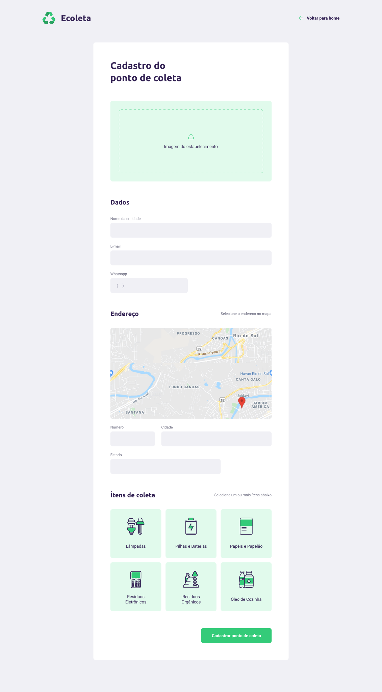

<div align="center"> </div>

# Ecoleta
> O Ecoleta é uma aplicação (web e mobile) com o intuito de facilitar a forma de pessoas encontrarem um ponto de coleta de resíduos. <br />
> Esse projeta faz parte da primeira edição do Next Level Week da Rocketseat, que tem como intuito ensinar as tecnologias mais utilizadas do mercado **React**, **React Native**, e **Node**. <br> <br>
> Por questão de conhecimento, resolvi fazer o Backend em **Asp.Net Core (C#)**, utilizando alguns Padrões de Projeto (Design Patterns), como **Repositories Pattern** e **Data Transfer Object (DTO)**. Porém o Frontend foi feito com **React**.

## Tecnologias
- [Asp.Net Core](https://docs.microsoft.com/pt-br/aspnet/core/?view=aspnetcore-3.1)
- [EntityFrameworkCore](https://docs.microsoft.com/pt-br/ef/)
- [TypeScript](https://www.typescriptlang.org/)
- [React](https://reactjs.org/)
- [SQLite](https://www.sqlite.org/index.html)

### Web

<div align="center"> </div>

## Como Usar
Clone o projeto usando a url `https://github.com/Henrique-Santos-da-Silva/nlw-01-Booster.git`

### Pré-Requistos
Para usar é necessário ter os seguintes pré-requisitos:

- [.Net Core 3.1](https://dotnet.microsoft.com/download/dotnet-core/3.1)
- [Adicionar referência do EF Core ao .Net Core CLI](https://docs.microsoft.com/pt-br/ef/core/miscellaneous/cli/dotnet)
- [Node](https://nodejs.org/en/)

### Backend
Se você estiver usando o CLI Navegue até `nlw-01-Booster/Backend/Backend` e digite os seguites comandos:
```
dotnet restore
dotnet ef database update
dotnet watch run
```

### Web
Para executar o Frontend navegue até `nlw-01-Booster/web` e digite:
```
npm install ou yarn
npm run start ou yarn start
```


